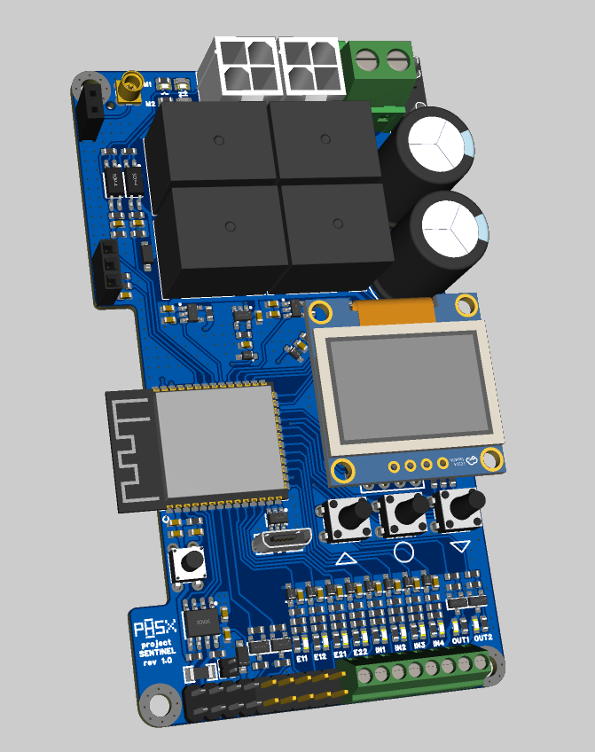
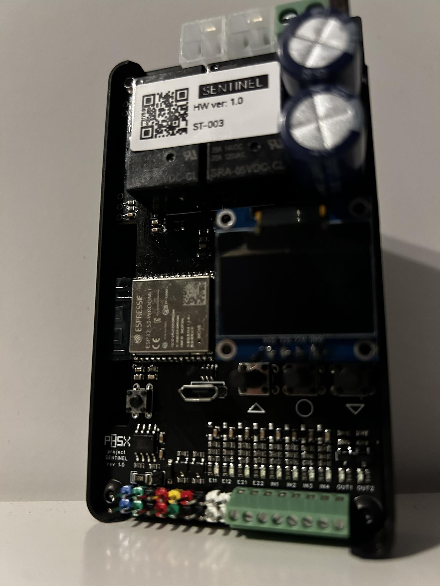

# Sentinel

&nbsp;

  
&nbsp; &nbsp; &nbsp; &nbsp;
  

Goal of project was to create dual DC motor driver for controlling dual wing gate. Main requirements were:
- Handle up to 40V/(3A per channel)
- Current feedback
- Small form factor

## Hardware
Board is based on [ESP32-S3-WROOM-1-N8](https://www.espressif.com/sites/default/files/documentation/esp32-s3-wroom-1_wroom-1u_datasheet_en.pdf)
Each motor is connected to driver using 4 wires (2 for power, 2 for impulse counter). 
Features:
- 2 NMOS Output
- OLED with button controls
- 4 input (screw terminal)
- 4 intpu (for endstop's via pin header)
- External I2C header
- RS485 trcv

### Schematic && PCB Design
Will be avaible soon on EasyEDA PRO

### Comments
Software is under development major changes can occur.
There were few mistake in pcb schematic (wrong footprint/spacing already fixed in v1.1)

## Used libraries
[U8G2](https://github.com/olikraus/u8g2) - licensed under the terms of the new-bsd license
[ghota](https://github.com/Fishwaldo/esp_ghota) - MIT license
[esp32-button](https://github.com/craftmetrics/esp32-button) - MIT license
## License
Sentinel is licensed under General Public License v3 ( GPLv3 ).
 
 

